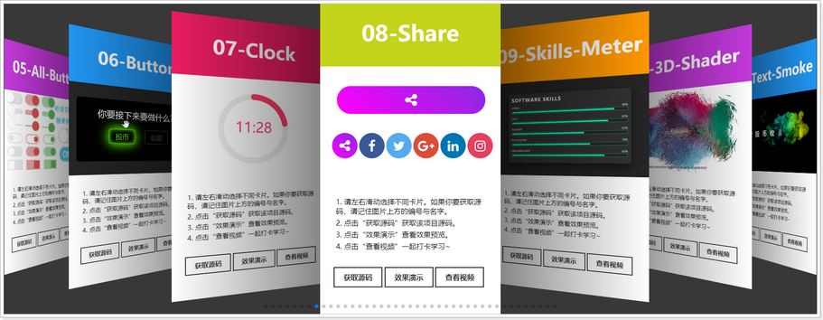

# 
[HTML+CSS]模板👋

	
		
	
	

## 📌简介说明：
*  `Demo` 收集自**互联网平台**，包括但不限于 *Youtube*、*bilibili* 等。
* 由于 `Demo` 过多，在线预览可能加载过慢，强烈建议你下载本项目到本地预览查看。
* 不同浏览器的兼容性不同，本仓库所有 `Demo` 在Chrome浏览器测试正常运行。

## 📌在线预览
> 建议你使用Chrome浏览器访问~
* [点击这里快速预览 **所有模板**](https://https://demo.imrememberlee.top/)
* [GitHub](https://github.com/imrememberlee/imrememberlee_demo_static)

> 打开后效果如下图~

***

* 最后送大家一碗鸡汤❤️

> 当你的才华还撑不起你的野心的时候，你就应该静下心来学习； 
> 当你的能力还驾驭不了你的目标时，就应该沉下心来，历练； 
> 梦想，不是浮躁，而是沉淀和积累， 
> 只有拼出来的美丽，没有等出来的辉煌， 
> 机会永远是留给最渴望的那个人，学会与内心深处的你对话， 
> 问问自己，想要怎样的人生，静心学习，耐心沉淀，送给自己，也送给爱学习的你们。共勉。
